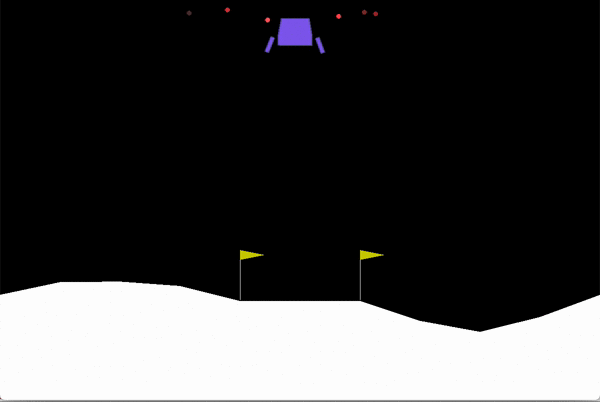

# LunarLander-model-using-Double-Q-Learning
This repository contains code and trained weights for LunarLander game. Training is done using Double Q Learning Algorithm in Reinforcement Learning.

This Repo also contains code for human's to play using Keyboard and compare their skill with my trained model. 
Run [keyboard_agent.py](./keyboard_agent.py) to play game manually and control the lander using "1", "2", and "3" keys.

Pre-trained [models](LunarLander_weights) after each 50 epochs and [graphs](LunarLander_graphs) for average_score are also provided.

Best model is chosen at epoch-3650. You can train your own LunarLander and compare its performance with mine.

## Demo GIF:

Video is also provided in Repository :[Demo_Video](Demo_Video.mp4).

[]
